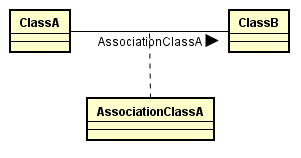

# Diagrama e código - Tipos de Relacionamento

## Geral - Multiplicidade

Considere um relacionamento de uma classe `A` para uma classe `B`

Considere que **coleções** são objetos que armazenam uma quantidade **infinita** de referências para outros objetos

Considere que **vetores** são objetos que armazenam uma quantidade **finita** de referências para outros objetos


* **1**
  * Um objeto da classe `A` possui uma referência para **um objeto** da classe `B`
  * A referência para a classe `B` é passada para o objeto da classe `A` pelo **construtor**, por ser obrigatória
* **0..1**
  * Um objeto da classe `A` possui uma referência para **um objeto** da classe `B`
  * A referência para a classe `B` é passada para o objeto da classe `A` por um método **setter**, por não ser obrigatória
* **0..*** ou *****
  * Um objeto da classe `A` possui uma referência para uma **coleção de objetos** da classe `B`
  * A referências para a classe `B` são passadas para o objeto da classe `A` por um método **add**, por não ser obrigatória
* **1..***
  * Um objeto da classe `A` possui uma referência para uma **coleção de objetos** da classe `B`
  * Uma referência para a classe `B` é passada para o objeto da classe `A` pelo **construtor**, mais referências são passadas pelo método **add**
* **x..y**
  * Um objeto da classe `A` possui uma referência para um **vetor de objetos** da classe `B` de tamanho `y`
  * `x` referências da classe `B` são passadas pelo **construtor** da classe `A`
  * Até `y - x` referências da classe `B` são passadas para o objeto da classe `A` por um método **add** 
* **x..***
  * Um objeto da classe `A` possui uma referência para uma **coleção de objetos** da classe `B` 
  * `x` referências da classe `B` são passadas pelo **construtor** da classe `A`
  * Outras referências da classe `B` são passadas para o objeto da classe `A` por um método **add** 
* **0..y**
  * Um objeto da classe `A` possui uma referência para um **vetor de objetos** da classe `B` de tamanho `y`
  * Até `y` referências da classe `B` são passadas para o objeto da classe `A` por um método **add** 
* **1..y**
  * Um objeto da classe `A` possui uma referência para um **vetor de objetos** da classe `B` de tamanho `y`
  * `1` referência da classe `B` é passada pelo **construtor** da classe `A`
  * Até `y - 1` referências da classe `B` são passadas para o objeto da classe `A` por um método **add** 


## Associação Unidirecional


Associação do tipo **has a**, onde um objeto da `ClassA` tem uma referência para um ou mais objetos da `classB`


**Forma geral**

```java
public ClassA{
    private ClassB classB;
    
    public void setClassB(ClassB classB){
        //...
    }
}

public ClassB{
    //...
}

```


## Associação Bidirecional


```java
public ClassA{
    private ClassB classB; //depende da multiplicidade
    
     public void setClassB(ClassB classB){
        //...
    }
}

public ClassB{
    private ClassA classA;//depende da multiplicidade
    
     public void setClassA(ClassA classA){
        //...
    }
}
```


## Classe de Associação




```java
public class ClassA {
	private AssociationClassA associationClassA;
}

public class ClassB {
    private AssociationClassA associationClassA;
}

public class AssociationClassA {
	private ClassB classB;
	private ClassA classA;
}
```


## Agregação


```java
public ClassA{
    private ClassB classb; //depende da multiplicidade
    
     public void setClassB(ClassB classB){
        //...
    }
}

public ClassB{
    //...
}
```


* É uma relação todo-parte
* As partes continuam a existir sem o todo


## Composição


```java
public ClassA{
    private ClassB classb;
    
     public ClassA(){
        this.classb = new classb(...);
    }
}

public ClassB{
    //...
}
```


- É uma relação todo-parte
- As partes deixam de existir sem o todo


## Herança


```java
public ClassA extends ClassB{
    //...
}

public ClassB{
    //...
}
```


## Realização


```java
public ClassA implements ClassB{
   //...
}

public interface ClassB{
    //...
}
```


# Multiplicidade

# `1..1`


```java
public ClassA{
    private ClassB classB;
  
    public ClassA(ClassB classB){
        this.classB = classB;
    }
}

public ClassB{
    //...
}
```


# `0..1`


```java
public ClassA{
    private ClassB classB;
    
    public void setClassB(ClassB classB){
        this.classB = classB;
    }
}

public ClassB{
    //...
}
```


# `1..n`


```java
public ClassA{
    private Collection<ClassB> classesB;
    
    
    public ClassA(ClassB classB){
        this.classesB = this.appendClassB(classB);
    }
    
    public void appendClassB(ClassB classB){
        //...
    }
}

public ClassB{
    //...
}
```

# `0..n`


```java
public ClassA{
    private Collection<ClassB> classesB;
 
    
    public void appendClassB(ClassB classB){
        //...
    }
}

public ClassB{
    //...
}
```

# `0..num`


```java
public ClassA{
    private ClassB[] = new classesB[num];
    
    public void appendClassB(ClassB classB){
        //...
    }
}

public ClassB{
    //...
}
```


## `num1..num2`

```java
public ClassA{
    private ClassB[] = new classesB[num2];
    
    public ClassA(ClassB classB){
        this.classesB = this.appendClassB(classB);
    }
    
    public void appendClassB(ClassB classB){
        //...
    }
}

public ClassB{
    //...
}
```

